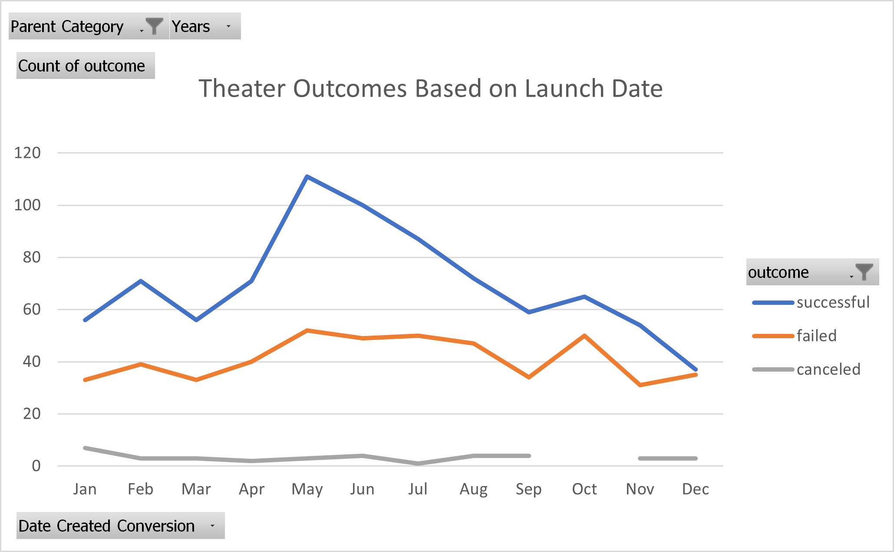
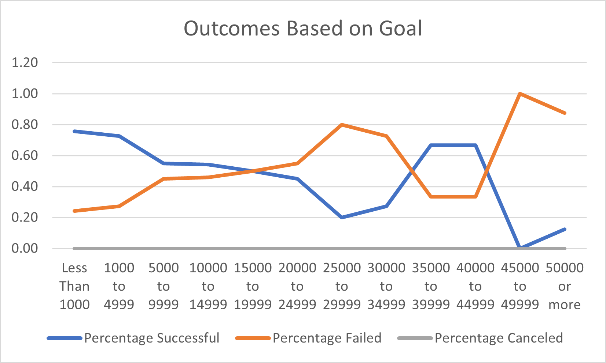

# Kickstarting with Excel

  

## Overview of Project

  

### Purpose
The purpose of this analysis is to give our client, Louise, an understanding of how her fundraising campaign fared in comparison to similar campaigns. Specifically, allowing her to compare the launch dates and funding goals of similar campaigns.

  

## Analysis and Challenges

  

### Analysis of Outcomes Based on Launch Date
The analysis of the outcomes base on launch date involved creating a pivot table with the following fields in the following categories
	

 - Filters
   - Parent Category
   - Years
  - Rows
	- outcome
- Columns
	- Date Created Conversion
- Values
	- Count of outcome
	
Finally, a line chart is generated from the pivot table as seen below:



  

### Analysis of Outcomes Based on Goals

  The analysis of outcomes based on goals involved creating a new table with the column headers Goal, Number Successful, Number Failed, Number Canceled, Total Projects, Percentage Successful, Percentage Failed, and Percentage Canceled. The contents of the goal column was manually entered and was used as labels. The labels entered were ranges of numbers so strings like "Less than 1000", "1000 to 4999", "5000 to 9999", and continuing by increments of 5000 up to the string "50000 or more". The "Number Successful/Failed/Canceled" columns were populated using a slightly varied version of ```=COUNTIFS(Kickstarter!$F:$F, "successful", Kickstarter!$Q:$Q, "plays", Kickstarter!$D:$D, ">=1000", Kickstarter!$D:$D, "<5000")```. The "Total Projects" column is a sum of the previous three columns. The "Percentage Successful/Failed/Canceled" columns are calculated using by dividing the respective Number column by the "Total Projects" column. Finally, a line chart is generated from the table as seen  below: 



### Challenges and Difficulties Encountered

The only hangup I encountered during my analysis was durign the analysis of outcomes based on goals. After I had generated my line chart, it did not match the provided line chart so I knew something was wrong. Eventually, I found that I accidentally passed the pledged column rather than the goal column into the formula. This was easily remedied by simply passing the correct column.

## Results

  

- What are two conclusions you can draw about the Outcomes based on Launch Date?

	A majority of campaigns are successful. Campaigns are more likely to be successful if launched in May.

- What can you conclude about the Outcomes based on Goals?

	100% of the campaigns with a goal between 45k and 50k failed making it that goal amount the worst possible.

- What are some limitations of this dataset?
While this data set is generally large it's still quite small for Louise's purposes. The most relevant data for her purposes will be the other campaigns on plays and here there are only 1047 campaigns with a "plays" subcategory. To me, this seems like a small data  set to base a campaign raising thousands or even tens of thousands of dollars on.
In addition, Louise is trying to optimize her campaign now in 2022. However, the data set ranges all the wat from 2009 to 2017. At best we're working with data from 5 years ago.

- What are some other possible tables and/or graphs that we could create?
We could create a similar table for Outcomes based on Launch Date but instead with percent successful/failed/cancelled like we did for Outcomes Based on Goals. We can also switch it around for Outcomes Based on Goals and use flat values rather than percentages.
